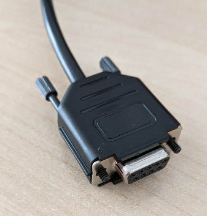

# Patient Monitor Data Logger
Datalogger for medical devices written in .NET/C# with web-frontend in React.js. 

Currently supported: 
- Philips Intellivue over MIB/RS232-interface. 

Built to run on Raspberry Pi.


## NuGet / .NET library

A NuGet package "mindleaving.PatientMonitorDataLogger" is available on NuGet.org. It contains clients for the supported medical devices.

See details in [PatientMonitorDataLogger](PatientMonitorDataLogger/README.md).

## Pre-assembled device

If you don't feel comfortable following the steps below to build and setup a datalogger, feel free to ask for a quote for a pre-assembled device. I cannot promise that I will have time to help you and UNDER NO CIRCUMSTANCES DO I TAKE RESPONSIBILITY FOR THE DEVICE, ITS SAFETY, LEGALITY OR ANY CONSEQUENCES THAT MAY RESULT FROM IT'S USE, but I will try my best to help.

## Build physical devices

**Parts**
- Raspberry Pi Model 4B
- USB-Type C Power supply with 3A or more (e.g. https://www.reichelt.de/de/de/shop/produkt/raspberry_pi_-_netzteil_5_1_v_5_0_a_usb_type-c_eu_schwarz-360111)
- Micro-SD card with 64+ GB capacity (e.g. https://www.reichelt.de/de/de/shop/produkt/microsdhx-speicherkarte_128gb-358273)
- Micro-SD card reader
- Waveshare 4.3" DSI Touch Display with Protective Case (https://www.waveshare.com/4.3inch-dsi-lcd-with-case.htm)
- USB-to-RS232 converter (e.g. Aten UC232A: https://www.reichelt.de/de/de/shop/produkt/usb_konverter_1_1_a_stecker_auf_rs-232-133502)
- 5 m F/UTP Cat 5+ cable (e.g. https://www.reichelt.de/de/de/shop/produkt/5_m_cat_5e_f_utp-netzwerkkabel_schwarz_rj45-307526)
- 2x D-Sub 9-Pin female connector (e.g. https://www.reichelt.de/de/de/shop/produkt/d-sub_buchse_9_polig-342349)

**Tools**
- Soldering iron
- Solder wire
- Cable cutter
- Wire stripper (optional, if you know how to remove cable isolation with cable cutters)
- Soldering stand ("third hand", often with flexible arms to hold wires and components while soldering. Optional, but makes the process a lot easier)
- Multimeter


### Raspberry Pi Assembly
**Step 1 - Connect touch display**

Follow these instructions to connect the touch display to Raspberry Pi Model 4B: https://www.waveshare.com/wiki/4.3inch_DSI_LCD

Use the short golden spacers and screws to attach your Raspberry Pi to the back of the display. Screw long golden spacers to all four corners of the touch display.


**Step 2 - Write Image to micro-SD card**

Follow instructions from Raspberry Pi to use their Raspberry Pi Imager to your micro-SD card: https://www.raspberrypi.com/software/

Edit configuration as follows:
- Set hostname (e.g. "datalogger01")
- Set username "datalogger" (must be spelled exactly this way. All further instructions are based on this username)
- Enable SSH using public key
- - Generate a public-private-key pair using ```ssh-keygen```. Recommended location and file name (asked when running the command): ```~/.ssh/<hostname>``` e.g. ```~/.ssh/datalogger01```. Further instructions: https://medium.com/@mbohlip/generating-ssh-key-pairs-on-a-windows-mac-linux-0e9993bf2985
- - Copy the content of the newly generate *public* key (.pub-file) to the Raspberry Pi Imager

**Step 3 - Custom setup**

As described in the installation instructions for the touch display in step 1, we need to modify the config.txt file on the micro-SD card's *bootfs* parition.
Add the following to the end of the config.txt file:

```
dtoverlay=vc4-kms-v3d
#DSI1 Use
dtoverlay=vc4-kms-dsi-7inch
#DSI0 Use
#dtoverlay=vc4-kms-dsi-7inch,dsi0
```

Safely eject the micro-SD card.

**Step 4 - Insert micro-SD card**

Insert the micro-SD card into the Raspberry Pi.

**Step 5 - Assemble the protective case**

Carefully place the Raspberry Pi and touch display into the protective case. Use 4 screws at the bottom to secure the long golden spacers to the case.


**Step 6 - Power on**

Attach an USB-Type C power supply. The Raspberry Pi should automatically turn on. Wait for it to finish installing and booting. Test the touch display. The Raspberry Pi is now ready for use.


### Cable Assembly


**Step 1 - Cut ethernet cable**

Cut the 5 m ethernet cable in half with cable cutters. Repeat the following steps with both halfs to make two cables (we only need one, but it's nice to have a backup).

**Step 2 - Remove isolation**

Start by removing 2 cm of the outer isolation using cable cutters. Make sure not to damage any of the inner wires. Remove the shielding foil. Cut away the grounding wires, if any are present (thin silver wires between the shielding foil and plastic wrapping). Remove the transparent plastic wrapping to lay bare the 4 wire pairs.

   

We need the following cables (**ASSUMPTION Philips IntelliVue MX-series! See manual for other pinouts**):
- Solid blue (RJ45 pin 4 -> RS232 Ground pin 5)
- Blue-white striped (RJ45 pin 5 -> RS232 Receive pin 2)
- Brown-white striped (RJ45 pin 7 -> RS232 Transmit pin 3)

Cut away any other wires. Remove 2-3 mm of of isolation from these wires.


**Step 3 - Soldering**

Solder the 3 wires to the D-sub 9-pin female connector. Make sure you know which pins on the connector correspond to pin 2, 3 and 5. It's easy to confuse these pins and end up with a mirrored configuration (I did so myself. Twice...). Have a lock at this page: https://www.decisivetactics.com/support/view?article=db-9-connector-pinout


**Step 4 - Test connection**

Use a multimeter to test that all three pins of the RJ45 connector and the D-Sub connector are correctly connected AND there isn't any connection to any other pins or the housing AND no shorts between pins.

**Step 5 - Assemble connector housing**

Assemble the connector housing.

 

## Software installation

**Step 1 - Connect Raspberry Pi to internet**

Use an Ethernet cable to connect your Raspberry Pi to your local network. It may take several moments for the network to start up. Wait for the LEDs of the LAN port start blinking.

**Step 2 - Transfer scripts**

Locate the ```deployment``` folder of the repository and copy install script and content to your Raspberry Pi using SSH's ```scp```-command:

```
cd <path to this repository>/deployment
scp -i ~/.ssh/datalogger01 install.sh datalogger@datalogger01:~
scp -i ~/.ssh/datalogger01 config.zip datalogger@datalogger01:~
scp -i ~/.ssh/datalogger01 PatientMonitorDataLogger.*.zip datalogger@datalogger01:~
```

**Step 3 - Setup system**

Log into your Raspberry Pi using SSH:

```
ssh -i ~/.ssh/datalogger01 datalogger@datalogger01
```

Now enable and run install.sh:

```
chmod +x install.sh
./install.sh
```

**Step 4 - Open web interface**

Open a browser (I use Chromium) and navigate to http://localhost/. 

To start the web interface on startup and make most of the limited screen space open Chromium's menu, navigte to "More tools" > "Developer Tools" and select "Install site as App". Activate "Desktop Shortcut".

Close Chromium and use the Desktop Shortcut to start the web interface again. Click on the "..." in the task window header > Select "App Info" > "Settings". Activate "Start app when you sign in".

**Step 5 - Test connection to patient monitor**

- Connect an USB-to-RS232-converter cable to any of the USB ports. 
- Connect your custom cable to the converter and a Philips IntelliVue's MIB/RS232 port.
- Configure your Philips IntelliVue monitor for data export on the MIB/RS232 port. Configure a fixed baud rate of either 115200 bit/second or 19200 bit/second.
- In the web interface select "+ Create configuration", select "Philips IntelliVue", the /dev/ttyUSB0 port (if not available, check your USB-to-RS232-converter) and the chosen baud rate. Click "Create".
- Open the new configuration and click "Start".
- If the monitor has any valid numeric measurements, up to 5 of them should be shown in the web interface, if you didn't unselect "Numerics" on the configuration page.
- Now stop the recording by clicking "Stop".
- Insert a USB drive. Cancel the popup window.
- Click "Copy to USB drive". Select your USB drive and click "Copy".
- Click on "Eject" in the systems taskbar at the top of the screen. 
- Make sure there the recorded data is on the USB drive.

