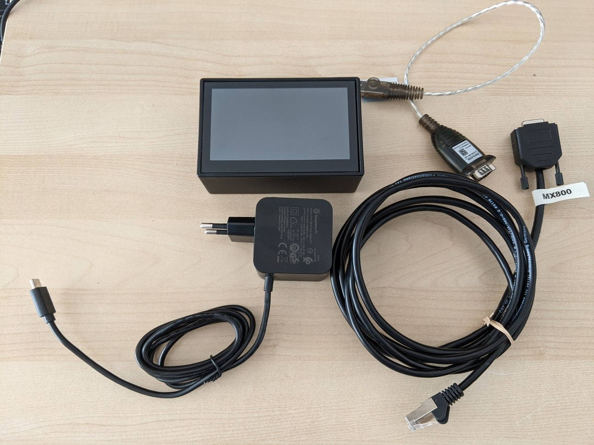

# Technical Documentation for Medical Device Data Logger
## The Product
Medical Device Data Logger, hereafter called The Product, consists of

- a small computer (Raspberry Pi Model 4B) with a 4.3 inch touch screen enclosed in a protective plastic case
- a 27 W USB Type-C power supply
- a USB Type A-to-RS232-D-Sub 9-pin male Adapter 30cm long
- a 2.5 m custom cable with D-sub 9-pin female to RJ45 connectors, wired accoring to specifications in Philips Intellivue Patient Monitor Data Export Interface Programming Guide (ID 453665127791, Published in Germany 09/2024).

Below image shows all involved components



### Functionality
The Product runs a  software with a web API and web frontend which enables the user to record data from supported medical devices like patient monitors and infusion pump systems. These data are recorded on the device, until deleted by the End User, and can be copied to a USB Drive for further use. The device is solely operated using the built-in touch screen. It powers on when connected to main electricity grid using the USB Type-C power supply.

## Manufacturer
Instructions for building the Product are available on https://github.com/mindleaving/patient-monitor-datalogger under a MIT License. Below manufacturer is not liable for any Products build by third parties using these instructions.

The Product can be ordered from the Manufacturer, in which case usual product liability laws apply.

The Product is developed and manufactured by

````
Jan Scholtyssek
Poststr. 28
69115 Heidelberg
Germany
````


## Bill Of Material

| Component            | Product Number | Manufacturer      | Standards |
| ---------------------|----------------|-------------------|-----------|
| Raspberry Pi Model 4 | PI4 MODEL B/4GB | Raspberry Pi Inc. | EMC, RED, IEC, RoHS |
| Pi 27 W USB Type-C Power Supply | SC1157 | Raspberry Pi Inc. | IEC, RoHS |
| 4.3" DSI Touch Display | 4.3inch DSI LCD (with case) | Waveshare | |
| Protective Case | 4.3inch DSI LCD (with case) | Waveshare | |
| Micro-SD Card 128 GB | SDSQUAB-128G-GN6MA | SanDisk | |
| USB-to-RS232 Serial Adapter UC232A | Aten | RoHS |

## Risk Assessment and Mitigation
### Risks due to Use of Product
### Risks due to Effects on Environment
### Safety Critical Components
### Independent Conformity Assessment

## Testing procedures

## Harmonized Standard Compliance Evaluation
### Relevant Standards, Regulations and Directives
- General Product Safety Regulation (GPSR)
- Electromagnetic Compatibility (EMC)
- Low Voltage Directive (LVD)
- Radio Equipment Directive (RED)
- Restriction of the use of certain hazardous substances (RoHS)

### General Product Safety
#### Intended User
#### Design and Composition
#### Features
#### Effect on other Products
#### Information to End User
#### Enclosure and Markings
#### Cybersecurity
#### Continuous Product Safety Monitoring and Recall Procedures
##### Monitoring Recall of Materials Used
##### Safety Business Gateway Notification
##### Product User Registry
##### Accident Registration
##### Recall Procedure

### Electrical Safety


### Environmental Safety
#### RoHS Conformity


### Quality Assurance Procedures for each produced datalogger
Each Product

## Declaration of Conformity

## References

### General Product Safety Regulation

Regulation (EU) 2023/988 of the European Parliament and of the Council of 10 May 2023 on general product safety, amending Regulation (EU) No 1025/2012 of the European Parliament and of the Council and Directive (EU) 2020/1828 of the European Parliament and the Council, and repealing Directive 2001/95/EC of the European Parliament and of the Council and Council Directive 87/357/EEC (Text with EEA relevance)

PE/79/2022/REV/1

OJ L 135, 23.5.2023, p. 1–51

ELI: http://data.europa.eu/eli/reg/2023/988/oj


### Blue Guide

Commission Notice — The ‘Blue Guide’ on the implementation of EU products rules 2016 (Text with EEA relevance)

C/2016/1958

OJ C 272, 26.7.2016, p. 1–149

https://eur-lex.europa.eu/legal-content/EN/TXT/?uri=CELEX:52016XC0726(02)

### Low Voltage Directive

Directive 2014/35/EU of the European Parliament and of the Council of 26 February 2014 on the harmonisation of the laws of the Member States relating to the making available on the market of electrical equipment designed for use within certain voltage limits (recast) Text with EEA relevance

OJ L 96, 29.3.2014, p. 357–374

ELI: http://data.europa.eu/eli/dir/2014/35/oj

### Electromagnetic Compatibility

Directive 2014/30/EU of the European Parliament and of the Council of 26 February 2014 on the harmonisation of the laws of the Member States relating to electromagnetic compatibility (recast) Text with EEA relevance

OJ L 96, 29.3.2014, p. 79–106

ELI: http://data.europa.eu/eli/dir/2014/30/oj


### RoHS

Directive 2011/65/EU of the European Parliament and of the Council of 8 June 2011 on the restriction of the use of certain hazardous substances in electrical and electronic equipment (recast) Text with EEA relevance

OJ L 174, 1.7.2011, p. 88–110

ELI: http://data.europa.eu/eli/dir/2011/65/oj


### Radio Equipment Directive

Directive 2014/53/EU of the European Parliament and of the Council of 16 April 2014 on the harmonisation of the laws of the Member States relating to the making available on the market of radio equipment and repealing Directive 1999/5/EC Text with EEA relevance

OJ L 153, 22.5.2014, p. 62–106

ELI: http://data.europa.eu/eli/dir/2014/53/oj


## Annex
